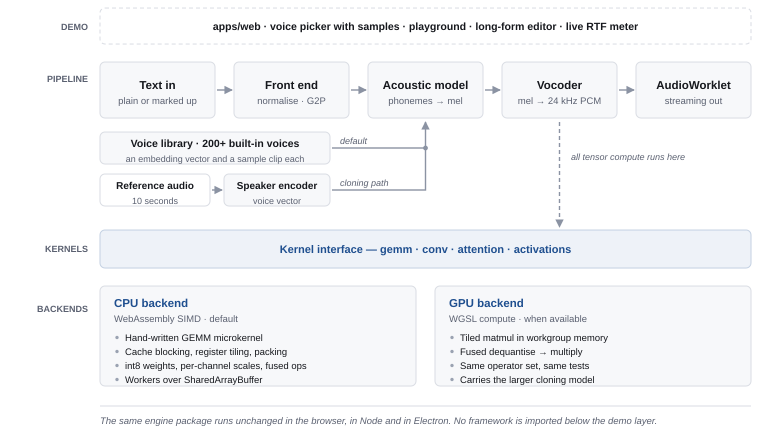
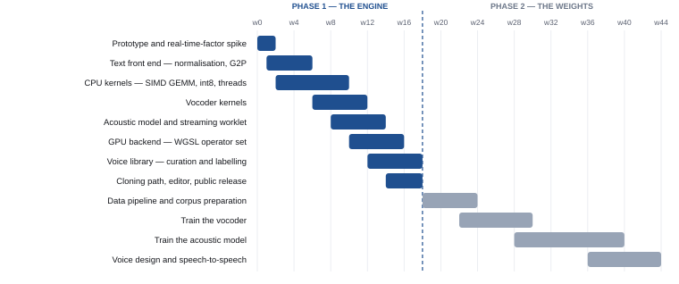

# Cadence

## A speech synthesis engine that runs anywhere

**Author:** Saeed Hussain — Full-Stack Software Engineer, AiroxLab
**Date:** 19 September 2026
**Status:** In progress — M0 done 3 October 2026; M2 (kernels) next
**Roadmap entry:** `PROJECTS-ROADMAP.md` #16
**Languages:** JavaScript (ES2023+) · WebAssembly SIMD · WGSL · PyTorch for training only

---

## 1. Summary

Cadence is a text-to-speech and voice-cloning engine in which every compute kernel is
written by hand. It runs on the machine in front of the user — faster than real time on
an ordinary CPU with no GPU at all, and faster still on the GPU when one is available.

It ships with **a library of more than two hundred built-in male and female voices**,
selectable immediately and usable without supplying any audio of your own. Voice cloning
from a reference recording is the second, opt-in path, not the primary way the product
is used.

There is no API key, no server, no `transformers.js` and no ONNX Runtime. It is free and
unlimited for the person using it because the inference is theirs, which is the only
honest way anything is ever unlimited and free.

The project is delivered in two phases. **Phase 1** builds the inference engine and
ships a working product. **Phase 2** replaces the model weights with weights trained from
scratch, ending in a claim very few engineers can make: *I trained the model and I wrote
the kernels it runs on.*

---

## 2. What this project is for

The existing portfolio says *"I ship business software end to end."* That is valuable and
it is crowded. Cadence makes a second, rarer claim: *"I build the layer underneath."*

Almost every developer who works with speech integrates a speech API. Almost nobody
implements speech synthesis, and the small number who do are not doing it in a browser
tab, on a CPU, in JavaScript. A hand-written SIMD microkernel that turns a neural model
into something real time without a GPU is work that machine-learning systems engineers
recognise on sight.

It also has a property no other project on the roadmap has: **the output is audible.** A
stranger can evaluate it in four seconds by pressing play. Database engines and consensus
protocols have to be explained; this one does not.

---

## 3. The constraint that defines the project

**It must be fast on a CPU.** This is not a performance target to be chased after the
engine works. It is an architectural decision that has to be made before the first line
is written, because it eliminates most of the model space:

| Architecture | Why it is ruled out |
|---|---|
| Diffusion / flow matching | Runs the network 16–32 times per utterance. Hopeless without a GPU. |
| Autoregressive token models | Latency grows with output length, and the models are large. |
| **Non-autoregressive, single pass** | **One forward pass. The only shape that reaches real time on a CPU.** |

The single-pass lineage is therefore the default path. Choose it on day one, or rewrite
the engine in month four.

---

## 4. The trade-off, stated rather than hidden

Speed, quality and zero-shot voice cloning: **pick two.** The small single-pass models
are fast because they are small. The models that convincingly clone a stranger from ten
seconds of audio are large and iterative. Nobody has collapsed that, and better kernels
will not collapse it either.

So the engine ships two paths behind one interface, and the product is honest about
which one the user is on:

| | Fast path | Cloning path |
|---|---|---|
| **Default** | Yes | Opt-in |
| **Runs on** | CPU, any machine | GPU via WebGPU |
| **Model** | Small, non-autoregressive | Larger, cloning-capable |
| **Voices** | 200+ built-in, male and female | Any voice, from ~10 s of reference audio |
| **Speed** | Faster than real time | Slower, still local |
| **Purpose** | Makes "unlimited" true everywhere | Makes the feature list complete |

One engine, two model sizes, one kernel interface. The interface is the engineering. The
honesty about which path is active is the product design.

### 4.1 The voice library

A large built-in voice set is cheap in exactly the way it looks expensive. In a
multi-speaker model a voice is **not a model — it is a speaker embedding**, a single
vector of a few hundred floats. Two hundred voices is therefore a few hundred kilobytes
of data shipped alongside one model, not two hundred models to store, load or download.
The library costs effectively nothing at runtime, and adding the two-hundred-and-first
voice costs nothing either.

Three things supply the voices:

1. **The training corpus.** Open multi-speaker speech corpora contain hundreds to
   thousands of distinct speakers. A model trained across them yields an embedding per
   speaker as a by-product.
2. **Sampling the embedding space.** Voices that belong to no real person can be
   generated by sampling and interpolating within the learned speaker space. This is the
   same mechanism as voice design, and it means the library is not capped by the corpus.
   It is also the ethically cleaner source, since a synthetic voice impersonates nobody.
3. **Curation, which is the actual work.** Raw corpus speakers are uneven — noisy
   recordings, thin coverage, unpleasant timbre. Reaching two hundred *good* voices means
   auditioning many more, rejecting most, then labelling what survives by gender, age
   range, accent, and timbre, naming them, and building a picker that makes the set
   browsable rather than a list of identifiers.

The engineering here is modest; the curation and the labelling are not, and they are
scheduled as real work rather than assumed.

### 4.2 Auditioning a voice before using it

The user journey is **browse, listen, pick, generate**. That requires a short audio
sample for every voice in the library, and those samples are pre-rendered rather than
synthesised on demand, for two reasons:

- **Scrolling a list of two hundred voices needs instant playback.** Half a second of
  inference per click is tolerable once and irritating on the twentieth voice.
- **The picker then works before the model has finished loading.** Model download is the
  slowest part of first use. Pre-rendered samples let someone browse and choose during
  it, which converts dead waiting time into the most interesting part of the product.

The samples are cheap. Roughly five seconds of Opus per voice is on the order of 15 kB,
so the full set lands near 3 MB, lazy-loaded as the list scrolls and cached thereafter.
They are generated by the engine itself as the last step of curation: adding a voice
generates its sample, so the library and its previews cannot drift apart.

**A flat list of two hundred voices is unusable**, so the picker is a real deliverable
and not a dropdown. It needs search, filtering by gender, age range, accent and language,
an inline play control on every row, and a way to keep the handful of voices a given user
actually returns to. Custom preview text — hearing a voice say *your* sentence rather
than the canned one — is the live-engine path, and the obvious bridge from browsing into
generating.

---

## 5. Architecture

Both voice sources converge on the same input to the acoustic model: a speaker embedding.
Selecting a built-in voice is a lookup in the library; cloning runs the reference audio
through the speaker encoder to produce the same kind of vector. Everything downstream is
identical, which is why the built-in library costs the engine nothing.

The boundary that matters is the **kernel interface**. Model code is written once against
an operator set — `gemm`, `conv`, `attention`, activations — and each backend implements
that set. The same operator tests run against both, so a disagreement between CPU and GPU
output is a test failure rather than a mystery.

Above it, nothing knows a web framework exists. `packages/cadence` is a plain JavaScript
package importable from Node, from a browser and from Electron. `apps/web` is the Next.js
demo that makes it visible, and it imports the engine, never the reverse.

---

## 6. Scope

The commercial products in this space are not one model; they are roughly seven model
families. Attempting all of them in one repository produces an abandoned repository.
Synthesis is the coherent half, and it is already a year of work.

| Feature | In scope | Where, or why not |
|---|---|---|
| Text to speech, multilingual | **Yes** | Phase 1, both backends |
| 200+ built-in male and female voices | **Yes** | Phase 1, CPU path — embeddings, not models |
| A pre-rendered sample for every voice | **Yes** | Phase 1 — generated by the engine during curation |
| Searchable, filterable voice picker | **Yes** | Phase 1, the Next.js demo |
| Streaming with low time-to-first-audio | **Yes** | Phase 1 |
| Long-form editor with per-line control | **Yes** | Phase 1, the Next.js demo |
| Instant voice cloning from seconds of audio | **Yes** | Phase 1, GPU path |
| Professional cloning by fine-tuning | **Yes** | Phase 2, reuses the training pipeline |
| Voice design from a text description | **Yes** | Phase 2, sampling the speaker-embedding space |
| Speech to speech / voice conversion | **Yes** | Phase 2, same conditioning, different encoder |
| Speech to text | No | A separate ASR engine, and its own project |
| Dubbing | No | Needs ASR, translation and forced alignment on top |
| Sound-effect and music generation | No | Different model families entirely |
| Voice isolation and denoise | No | Source separation — belongs with the audio DSP project |

---

## 7. Plan

### Phase 1 — the engine (weeks 0–18)

Validated against existing open weights, used strictly as data and as a correctness
reference. Ends in a finished, shippable, offline product.

| Milestone | Week | Done means |
|---|---|---|
| **M0 — the spike** | 2 | A throwaway prototype reports a real-time factor on the target CPU. The number decides the model size before anything else is built. |
| **M1 — it speaks** | 6 | Text normalisation and G2P produce correct phonemes for a held-out test set. |
| **M2 — it is fast** | 10 | The SIMD GEMM microkernel beats the naive implementation by an order of magnitude, with the number published. |
| **M3 — it is audible** | 14 | End-to-end synthesis through the vocoder, streaming to an AudioWorklet with no underruns. |
| **M4 — it is portable** | 16 | The GPU backend passes the same operator tests as the CPU backend. |
| **M4b — it has voices** | 18 | 200+ voices auditioned, filtered, labelled by gender, age and accent. Every voice has a generated sample, and the picker makes them searchable and playable before the model loads. |
| **M5 — it ships** | 18 | Cloning path, editor, deployed demo, README, benchmarks, design document. |

### Phase 2 — the weights (weeks 18–44)

| Milestone | Week | Done means |
|---|---|---|
| **M6 — the corpus** | 24 | A reproducible data pipeline over open speech corpora. |
| **M7 — your vocoder** | 30 | A vocoder trained from scratch, swapped in, with an honest quality comparison. |
| **M8 — your model** | 40 | An acoustic model trained from scratch, and the end-to-end claim becomes true. |
| **M9 — the rest** | 44 | Voice design and speech-to-speech built on the trained embedding space. |

The ordering is the risk strategy. Phase 2 needs rented GPUs and can stall on budget;
Phase 1 cannot, and leaves a defensible finished project standing either way.

---

## 8. How success is measured

Every number below is published in the README, measured on named hardware, including the
cases where it loses to the commercial products.

| Metric | Target | Why this one |
|---|---|---|
| **Real-time factor, CPU** | < 0.3 on 4 threads, no GPU | The headline claim. Anyone can verify it by running it. |
| **Time to first audio** | < 200 ms | What "fast" actually feels like. Throughput matters less than this. |
| **Real-time factor, GPU** | Well under CPU, measured | Proves the second backend earns its existence. |
| **Memory ceiling** | Runs in a browser tab without crashing it | Quantisation is load-bearing, not decorative. |
| **Voice library size** | 200+ voices in well under 1 MB | Proves voices are embeddings and not two hundred models. |
| **Preview payload** | ~3 MB for the full set, lazy-loaded | Browsing must stay cheap, and must work before the model does. |
| **Time to first audition** | Playable before the model finishes loading | The picker is the first thing anyone touches. |
| **Kernel speedup** | ≥ 10× over the naive baseline | The single most defensible piece of engineering in the repo. |
| **Backend agreement** | CPU and GPU within tolerance | Correctness, tested rather than assumed. |

---

## 9. Risks

| Risk | Severity | Response |
|---|---|---|
| The CPU is simply not fast enough at the needed quality | High | M0 exists to find this out in week two. If the number is bad, the model size is the dial — learn it in week one, not month four. |
| Phase 2 compute cost runs away | Medium | Phase 1 ships independently. Train the vocoder first: it is cheap, it is a complete result on its own, and it derisks the pipeline. |
| Scope creep toward the full product surface | High | Section 6 is the contract. ASR, dubbing and music generation are separate projects or they are nothing. |
| Weight licensing for the Phase 1 reference models | Medium | Verify terms before use; this corner of the ecosystem shifts. Phase 2 removes the dependency entirely. |
| Voice cloning misuse | Medium | An inaudible watermark in all output and a consent step on reference upload. Reasoned through openly in the design document. |
| Silent numerical bugs in hand-written kernels | High | Every operator tested against a reference implementation, both backends, from day one. This is where projects like this actually die. |
| The 200 voices are uneven, or barely distinguishable from each other | Medium | Curation is scheduled work with a rejection rate, not a data dump. A smaller set of genuinely distinct voices beats a padded count. |

---

## 10. Deliverables

- `packages/cadence` — the engine. Plain JavaScript, no framework, no bundler assumptions.
- `packages/cadence-kernels` — the CPU and GPU backends behind one operator interface.
- `apps/web` — the Next.js demo: the voice picker, playground, long-form editor, live
  RTF meter.
- **The voice library as data** — labelled metadata plus a generated sample per voice,
  built by a repeatable pipeline rather than assembled by hand.
- A **deployed URL** that synthesises speech with no account and no quota.
- A **design document**: the architecture, the trade-offs taken knowingly, what would be
  done differently.
- **Published benchmarks** on named hardware, including the losses.
- **A written post** on the SIMD microkernel. That post will reach more people than the
  repository will.

---

## 11. Decisions

### Taken

1. **Which reference weights for Phase 1** — decided by M0 on 3 October 2026, by
   measurement on the slowest target machine (Intel Core i5-4310U, 2 cores / 4 threads,
   8 GB). Every number is in `docs/BENCHMARKS.md`.
   - **Fast path: Piper LibriTTS-R medium.** VITS, about 15M parameters, 904 speakers in
     one 75 MB model. Natively RTF 0.132 with first audio at 200 ms, inside the 0.3
     target, and the best-sounding of the fast candidates in a listening test. Its
     speakers are the built-in library: a speaker index into one model, as §4.1 predicts.
   - **Higher-quality path: Kokoro-82M, in fp32.** Natively RTF 1.43 here, slower than
     real time, so it is opt-in rather than the default. Its int8 weights were the
     slowest format measured (2.87), not the fastest.
   - **Not chosen:** Piper Lessac low and medium (as fast, one voice each) and Piper
     Lessac high (0.91, too close to real time to stream reliably).

   The fast model in the browser (onnxruntime-web, WebAssembly) runs at RTF 0.448 on one
   thread: faster than real time, 3.4× slower than native, outside the target. WebGPU
   does not run it (an unsupported integer `GatherND`). ONNX Runtime's profiler puts 82%
   of the browser's time in convolution, 70% `Conv` and 12% `ConvTranspose`, almost all
   of it in the vocoder's residual blocks: 32 to 64 channels over 50,000+ samples,
   kernels of 3 to 7. That is the shape the M2 kernels are written for.

### Still open

1. **Languages at launch** — English only is defensible for Phase 1; multilingual widens
   the G2P work considerably.
2. **Electron build or browser only** — Electron gives file-system access for long-form
   work; the browser gives a link anyone can open. The link probably matters more. M0
   adds a number: on the target machine the native runtime is 3.4× faster than the
   browser for the same model, until the M2 kernels close that gap.
3. **Threading fallback** — `SharedArrayBuffer` requires cross-origin isolation headers.
   A single-threaded path has to exist for environments that will not supply them. On
   the two-core target, one thread was measured faster than two or four for the fast
   model, so the fallback may also be the default there.
4. **How the voice library is sourced** — corpus speakers, sampled synthetic voices, or a
   mix. Synthetic voices impersonate nobody, which is the cleaner position, but they need
   the embedding space to be well behaved first. Decide after M3, when there is something
   to listen to.
5. **What the preview samples say** — one identical sentence across all voices makes them
   directly comparable; varied sentences show range but make comparison harder. Probably
   one shared sentence, with custom preview text available through the live engine.

---

## Two things to go in with, eyes open

**Nobody trains in JavaScript, including you.** Phase 2 is PyTorch on a rented box,
offline; the exported weights are what the JavaScript engine consumes. The engine is the
artifact and the engine is pure JavaScript. Say so in the README rather than implying a
pure-JS pipeline that will not exist.

**This is not branded as a clone of anything.** "Clone of X" reads as derivative. "A
speech synthesis engine with hand-written SIMD and GPU kernels" reads as systems work.
Same repository, a different category of reader.
